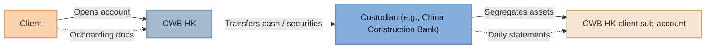
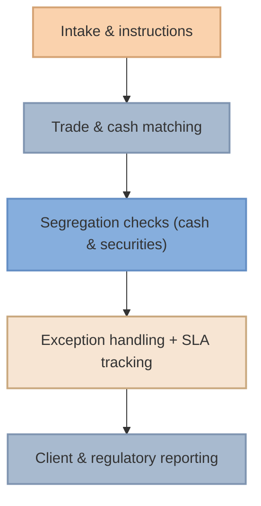

# CWB Hong Kong  

*Built on trust. Driven by vision.*

---

## Worldwide Reach  

### About Us  

CWB Hong Kong is an independent licensed custodian and investment management firm that specialises in the safekeeping of financial assets, brokerage, and asset management for institutional and private clients.  

We deliver a **private banking–style experience**, combining institutional-level security with personalised investment insight.  

As a licensed custodian, we ensure client assets are held safely with top-tier global partners, while our advisory team provides strategic solutions tailored to individual goals and market opportunities.  

CWB Hong Kong is licensed and regulated by the Securities and Futures Commission (SFC) under Central Entity (CE) code **AFQ783**.  

---

## Our Capabilities  

### Wealth Management and Private Banking Services  

#### Safe custody  

Our custodians include leading international financial institutions, providing secure, segregated safekeeping of client assets across major global markets.  

<div className="vendor-grid">

  <div className="vendor-card">
    <div className="vendor-header">
      
      <div className="vendor-title">
        <h3>BNY Mellon</h3>
        <span className="vendor-badge">Hong Kong</span>
      </div>
    </div>
    <div className="vendor-section">
      <strong>Role</strong>
      <p>Global Custodian</p>
    </div>
  </div>

  <div className="vendor-card">
    <div className="vendor-header">
      
      <div className="vendor-title">
        <h3>DBS Bank</h3>
        <span className="vendor-badge">Hong Kong</span>
      </div>
    </div>
    <div className="vendor-section">
      <strong>Role</strong>
      <p>Regional Custodian</p>
    </div>
  </div>

  <div className="vendor-card">
    <div className="vendor-header">
      
      <div className="vendor-title">
        <h3>China Construction Bank</h3>
        <span className="vendor-badge">Asia</span>
      </div>
    </div>
    <div className="vendor-section">
      <strong>Role</strong>
      <p>Asia Specialist</p>
    </div>
  </div>

  <div className="vendor-card">
    <div className="vendor-header">
      
      <div className="vendor-title">
        <h3>Maybank</h3>
        <span className="vendor-badge">Singapore</span>
      </div>
    </div>
    <div className="vendor-section">
      <strong>Role</strong>
      <p>ASEAN Specialist</p>
    </div>
  </div>

</div>

#### Asset management  

Our **open-architecture** investment platform provides access to a diverse selection of premier investment opportunities, both public and private:

- Public or privately subscribed funds
- IPOs / pre-IPO opportunities
- Private equity / VC / private debt
- APAC tech sector
- Non-traditional assets

#### Brokerage  

Seamless access to our network of market-makers provides global developed markets coverage as well as APAC and emerging markets opportunities, both public and private:  

<div className="vendor-grid">

  <div className="vendor-card">
    <div className="vendor-header">
      <div className="vendor-title">
        <h3>Global Markets</h3>
        <span className="vendor-badge">Tier 1 Execution</span>
      </div>
    </div>
    <div className="vendor-section">
      <div className="vendor-logo-group">
         
         
         
      </div>
      <strong>Firms</strong>
      <p>Haitong Securities, BNY Pershing, DBS Vickers</p>
    </div>
  </div>

  <div className="vendor-card">
    <div className="vendor-header">
      <div className="vendor-title">
        <h3>Electronic & Access</h3>
        <span className="vendor-badge">Direct Market Access</span>
      </div>
    </div>
    <div className="vendor-section">
      <div className="vendor-logo-group">
         
         
      </div>
      <strong>Firms</strong>
      <p>Interactive Brokers, iFast Financial</p>
    </div>
  </div>

  <div className="vendor-card">
    <div className="vendor-header">
      <div className="vendor-title">
        <h3>APAC / Regional</h3>
        <span className="vendor-badge">Specialist Coverage</span>
      </div>
    </div>
    <div className="vendor-section">
      <div className="vendor-logo-group">
         
         
         
         
      </div>
      <strong>Firms</strong>
      <p>Maybank, CGS Intl, CCB Intl, China Citic Bank</p>
    </div>
  </div>

</div>

#### Banking services  

Our platform is designed to give you streamlined payment services for personal, business, or corporate purposes, across all major currencies, linked to each client’s account.

---

## Risk Management  

### Robust risk management systems and controls  

- We establish and maintain **segregated accounts** for deposits of client money (cash) in any currency within one business day of receipt, with a Hong Kong licensed bank.  
- We ensure that **client securities** or securities collateral received are deposited in safe custody with one of our custodians in segregated accounts.  
- Each client’s assets are **ring-fenced** and will not be part of the estate of CWB HK, or any other client, in the event of liquidation.  
- CWB HK **does not engage in proprietary trading**, nor does it hold shareholder investments beyond operating cash. Our only business is to serve clients.  
- CWB HK **does not provide liquidity or leverage** to clients; we maintain a robust balance sheet aimed at stability, not return.  

---

## Account Opening Process  

As **legal custodians** of client assets, and based on the omnibus account model, we give clients access to global markets with emphasis on the APAC region.  

### Flow (omnibus custody model)



Operational steps:  
1) Client opens the account with CWB Hong Kong Limited.  
2) Client transfers cash or securities to CWB HK’s account with its custodian (e.g., China Construction Bank).  
3) CWB HK segregates the client’s assets into a dedicated sub-account at the custodian.  
4) The client’s assets are held by the custodian bank for safekeeping.  

---

## Account Operations  

Our **global team** is always on standby to ensure seamless execution and real-time support for all trading and transactional needs.  

Clients may reach us via **email**, **recorded phone line**, or **Bloomberg chat**.  

Whether executing trades, managing settlements, or coordinating cross-border transfers, our professionals deliver precise, efficient service aligned with the highest industry standards.  

### Operating controls (overview)



---

## Connect With Us  

**Email**  
enquiries@cwb-hk.com  

**Phone**  
+852 3893 9588  

**Office**  
Office 1803, The Henderson  
2 Murray Road, Central, Hong Kong  

**CWB Hong Kong**
``` :contentReference[oaicite:0]{index=0}
